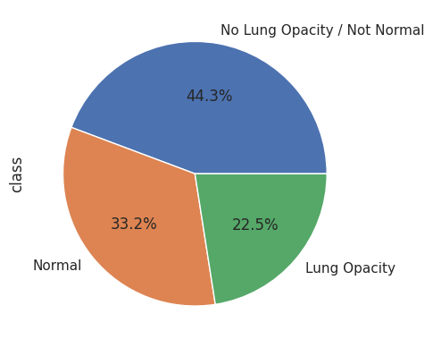

# Post Graduate Program in Artificial Intelligence and Machine Learning.
## CAPSTONE PROJECT - Pneumonia Detection Using Chest X-Ray Images

## Project Overview
This capstone project focuses on **automatic pneumonia detection using chest X-ray images** with deep learning techniques. The aim is to build a **computer-aided diagnosis (CAD) system** that assists radiologists by classifying X-ray images as **Pneumonia** or **Normal**.

The goal is to build a pneumonia detection system, to locate the position of inflammation in an image. Tissues with sparse material, such as lungs which are full of air, do not absorb the X-rays and appear black in the image. Dense tissues such as bones absorb X-rays and appear white in the image. While we are theoretically detecting “lung opacities”, there are lung opacities that are not pneumonia related. In the data, some of these are labeled “Not Normal No Lung Opacity”. This extra third class indicates that while pneumonia was determined not to be present, there was nonetheless some type of abnormality on the image and oftentimes this finding may mimic the appearance of true pneumonia.

**Dicom original images**: Medical images are stored in a special format called DICOM files (*.dcm). They contain a combination of header metadata as well as underlying raw image arrays for pixel data.
The project follows an end-to-end **medical machine learning pipeline**, including metadata processing, DICOM image handling, CNN-based model training, evaluation, and performance improvement strategies.

## Data fields
**patientId** - A patientId. Each patientId corresponds to a unique image.
**x** - the upper-left x coordinate of the bounding box.
**y** - the upper-left y coordinate of the bounding box.
**width** - the width of the bounding box.
**height** - the height of the bounding box.
**Target** - the binary Target, indicating whether this sample has evidence of pneumonia.

## Objectives
- To analyze medical chest X-ray images for pneumonia detection
- To preprocess and visualize DICOM medical images
- To build and train a deep learning CNN model
- To evaluate model performance using medically relevant metrics
- To explore model improvement techniques for higher diagnostic reliability

## About Pneumonia
Pneumonia is a serious lung infection that inflames air sacs in one or both lungs, which may fill with fluid or pus. **Chest X-rays** are one of the most commonly used diagnostic tools, making pneumonia detection a strong real-world application of deep learning and computer vision in healthcare.

## Dataset
- **Dataset:** RSNA Pneumonia Detection Challenge
- **Image Format:** DICOM (medical standard)
- **Classes:** Pneumonia, Normal, Not Normal
- **Annotations:** Bounding box coordinates for pneumonia regions
- **Metadata:** CSV files containing patient IDs and labels

The dataset combines medical images with structured metadata, enabling supervised learning.

## Technologies & Tools Used
- Python
- NumPy, Pandas
- Matplotlib
- TensorFlow / Keras
- DICOM image processing
- Google Colab / Jupyter Notebook

## Code Explanation (Workflow)

### 1. Library Imports
Used for numerical computation, data handling, visualization, deep learning, and medical image processing.

### 2. Metadata Loading & Validation
CSV files containing patient IDs and pneumonia labels are loaded and validated to ensure data consistency across files.

### 3. DICOM Image Processing
Chest X-ray images are loaded from DICOM format and converted into numerical arrays suitable for CNN input.

### 4. Data Visualization
Sample X-ray images are visualized along with bounding boxes highlighting pneumonia-infected regions for interpretability.

         

### 5. Annotation Extraction
Bounding box coordinates are extracted to identify pneumonia locations, improving supervised learning accuracy.
      

### 6. Data Generator
A custom data generator loads images batch-by-batch to efficiently train the model on large datasets without memory overflow.

### 7. CNN Model Architecture
A Convolutional Neural Network is built to automatically extract spatial features from chest X-ray images.

### 8. Model Training
The model is trained using backpropagation with optimized parameters to minimize classification error.

### 9. Model Evaluation
Performance is evaluated using validation data to ensure generalization and reliability.
      

## Model Details
- **Model Type:** Convolutional Neural Network (CNN)
- **Task:** Binary classification (Pneumonia / Normal)
- **Loss Function:** Binary Crossentropy
- **Optimizer:** Adam
- **Input:** Chest X-ray images
- **Output:** Probability of pneumonia presence

## Evaluation Metrics
Medical diagnosis prioritizes **Recall** to reduce false negatives.
- Accuracy
- Precision
- Recall (Critical for pneumonia detection)
- F1-Score

##  Model Performance Improvements
### Implemented
- Image normalization for stable training
- Batch-based data generators for scalability
- Deeper CNN layers for spatial feature extraction

### Proposed Enhancements
- Transfer learning using **DenseNet / ResNet** (medical imaging proven models)
- Data augmentation (rotation, flipping) to reduce overfitting
- Class weighting to handle dataset imbalance
- Hyperparameter tuning (learning rate, batch size)

## Results
- The Model got stuck at validation accuracy of 42%. Learning rate is too high. Using callbacks to improve learning rate and accuracy.
- Training accuracy is around 60.8% whereas validation accuracy is round 63.99%. We have avoided overfitting, but it seems to be clear that a normal CNN will not help us.
- The dataset is too large to fit into memory, so we need to create a generator that loads data on the fly.
    - The generator takes in some filenames, batch_size and other parameters.
    - The generator outputs a random batch of numpy images and numpy masks.
    - The execution time taken for each epoch took way too much time. Thus taking a sample of 1000 records each to execute further
- Training accuracy is around 97.24% whereas validation accuracy is around 96.4%.

